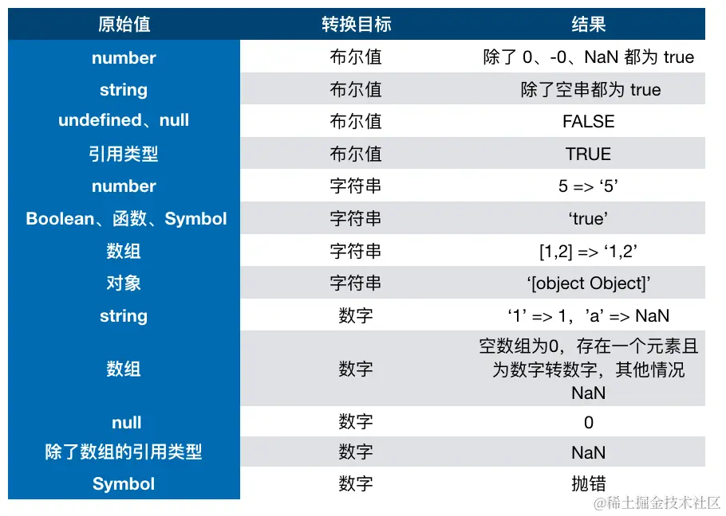

## 类型

JS数据类型：

1. 原始类型
2. 对象类型

## 原始类型

原始类型存储的是值，一般存储在栈上

- boolean
- null
- undefined
- number(浮点类型)
- string
- symbol
- bigint

> tips: `typeof null`会输出`object`，这是一种历史遗留bug，它就是原始类型

## 对象类型

对象类型存储的是地址（指针），数据存储在堆上

看一个示例：

```js
function test(person) {
    person.age = 26
    person = {
        name: 'zouhualu',
        age: 30
    }

    return person
}

const p1 = {
    name: 'hj',
    age: 25
}
const p2 = test(p1)
console.log(p1) // -> ?
console.log(p2) // -> ?
```

`p1`的值是`{age:26,name:'hj'}`，`p2`的值是`{age:30,name:'zouhualu'}`

## 类型判断

### typeof

`typeof`对于原始类型来说，除了`null`其余的都可以显示正确的类型，如果想要判断`null`的话可以使用`variable === null`

```js
typeof 1 // 'number'
typeof '1' // 'string'
typeof undefined // 'undefined'
typeof true // 'boolean'
typeof Symbol() // 'symbol'
typeof 1n // bigint
```

`typeof`对于对象类型来说，除了函数其余都会显示`object`，所以说`typeof`并不能准确判断变量到底是什么类型

```js
typeof [] // 'object'
typeof {} // 'object'
typeof console.log // 'function'
```

### instanceof

`instacnceof`通过原型链的方式来判断是否为`构建函数的实例`，常用于判断具体的对象类型

```js
const Person = function () {
}
const p1 = new Person()
p1 instanceof Person // true

var str = 'hello world'
str instanceof String // false

var str1 = new String('hello world')
str1 instanceof String // true
```

另外我们还可以直接通过构建函数来判断类型

```js
[].constructor === Array  // true
```

### Object.prototype.toString.call

`Object.prototype.toString.call`是判断对象类型的最佳方案，能判断的类型最完整

```js
Object.prototype.toString.call(null) // [Object Null]

Object.prototype.toString.call(1) // [Object Number]

Object.prototype.toString.call('') // [Object String]

Object.prototype.toString.call(1n) // [Object BigInt]

Object.prototype.toString.call([]) // [Object Array]

Object.prototype.toString.call({}) // [Object Object]

Object.prototype.toString.call(function () {
}) // [Object Funtion]
```

### is### 专属API

```js
Array.isArray([])  // true

isNaN(',')  // true
```

## 常见面试题

1. 说说`instanceof`的原理
2. 请手写`instanceof`
3. JS类型判断有几种方式

## 类型转换

这篇文章挺全的，可以直接看这篇：[最全的javascript类型转换规则精简总结](https://juejin.cn/post/7047524999774601224)

js类型转换只有三种情况:

- 转换为布尔值
- 转换为数字
- 转换为字符串



### 转Boolean

除了`undefined`、`null`、`false`、`NaN`、`''`(`空字符串`)、`0`、`-0`以外，其他都是`true`

### 对象转原始类型

对象在转换类型的时候，会调用内置的`[[ToPrimitive]]`函数

#### 对象转boolean

一般情况下，对象转`boolean`都是直接转换为`true`，而且不会调用对象的`[Symbol.toPrimitive]`，`toString`，`valueOf`这三个方法

#### 对象转string|number

ES5时期：对象的类型转换是通过内置或者自定义的`toString`, `valueOf`方法进行`to primitive`类型转换的.

##### 对象转`string`类型步骤是：

- 调用对象的`toString`方法，没有则去原型链上查找
    - 如果`toString`返回值为原始值, 对返回值进行原始值转`string`类型转换, 返回最终结果
    - 如果`toString`返回值为对象, 那么将调用对象的`valueOf()`方法
        - 如果返回值为原始值, 对返回值进行原始值转`string`, 转换后的结果即为对象转`string`的类型转换结果
        - 如果返回值为对象, 则报错

对象转`string`是先调用`toString()`, 并在返回值为对象的时候, 再调用`valueOf()`. 而对象转`number`的时候, 调用的顺序相反,
不过其他逻辑基本相同。

##### 对象转`number`类型步骤是：

- 调用对象的`valueOf()`方法, 没有则去原型链上查找
    - 如果`valueOf`返回值为原始值, 对返回值进行转`number`处理, 转换后的结果即为对象转`number`的类型转换结果
    - 如果`valueOf`返回值为对象, 那么将调用对象的`toString()`方法
        - 如果返回值为原始值, 对返回值进行转`number`的类型转换, 转换后的结果即为对象转`number`的类型转换结果
        - 如果返回值为对象, 则报错

|    类型    |               toString                |        valueOf         |
|:--------:|:-------------------------------------:|:----------------------:|
|  object  |          "[object < type >]"          |          指向自身          |
| function |               函数的字符串形式                |          指向自身          |
|  array   |      "arr0,arr1,..." 或者 ""(数组为空)      |          指向自身          |
|   date   |             包含本地时间信息的字符串              | 从1970年 1 月 1 日开始至今的毫秒数 |
|  regexp  |             正则表达式的字符串表示形式             |          指向自身          |
|  error   | 错误名+错误信息: "<err>.name:<err>.message"	 |          指向自身          |

在ES6, 开发者可以通过官方提供的`[Symbol.toPrimitive]`接口去定义`对象 to primitive`的行为。
需要注意的是, 如果自定义了对象的`[Symbol.toPrimitive]`的方法, 那么, 当`对象发生 to primitive类型转换`的时候, 那么只会调用`[Symbol.toPrimitive]`方法, 
而无视ES5中提供的`toString()`, `valueOf()`方法。
