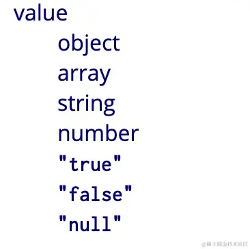
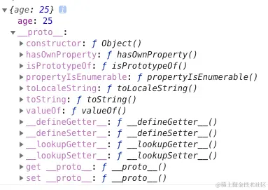
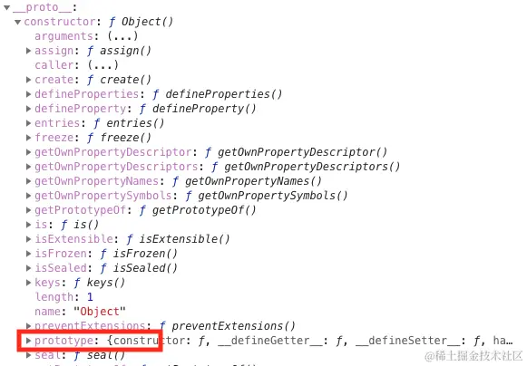
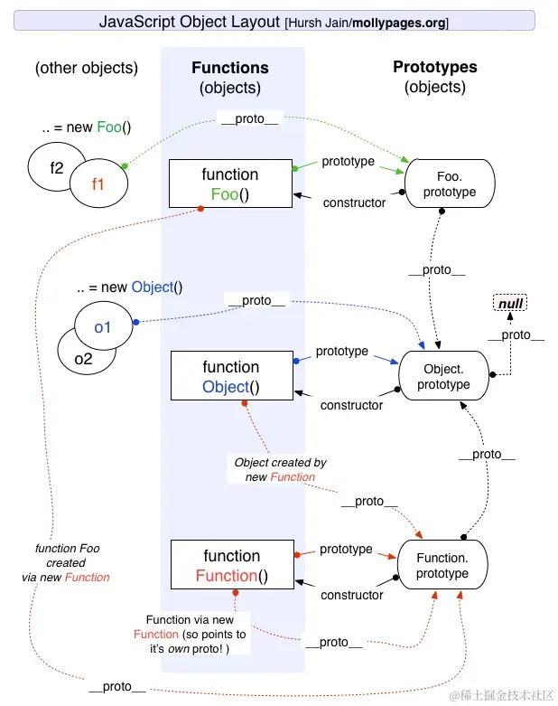

## `==` 与 `===`

对于`==`来说，如果两边类型不一样的话就会进行`类型转换`

判断流程：

1. 首先判断两边类型是否相同，系统的话就是比大小
2. 类型不相同的话，就会进行类型转换
3. 先判断是否在对比`null`和`undefined`，是的话返回`true`
4. 判断两边类型是否为`string`和`number`,是的话就会将字符串转为`number`
5. 判断其中一方是否为 `boolean`，是的话就会把 `boolean` 转为 `number` 再进重写进行判断流程
6. 判断其中一方是否为 `object` 且另一方为 `string`、`number`，是的话就会把 `object`
   转为原始类型再进行判断，也就是执行 `x.toString()` 及 `valueOf`

```
1 == '1'
      ↓
1 == 1
--------------
'1' == true
        ↓
'1' ==  1
        ↓
 1  ==  1
 -------------
 '1' == { name: 'yck' }
        ↓
'1' == '[object Object]'
```


## 闭包

推荐看这篇文章：[我从来不理解JavaScript闭包，直到有人这样向我解释它](https://juejin.cn/post/6844903858636849159?searchId=202311171434258441C440ED2B1600E826)

**闭包定义**：假如一个函数能访问外部的变量，那么就形成了一个闭包。

本质就是上级作用域内变量的生命周期，因为被下级作用域内引用，而没有被释放。
就导致上级作用域内的变量，等到下级作用域执行完以后才正常得到释放。

```js
let a = 1

// 产生闭包
function fn() {
    console.log(a);
}

function fn1() {
    let a = 1
    // 产生闭包
    return () => {
        console.log(a);
    }
}

const fn2 = fn1()
fn2()
```

## 深浅拷贝

### 浅拷贝

#### `Object.assign`

这个函数会拷贝所有的属性值到新的对象中，如果属性值是对象的话，拷贝的是地址

```js
let a = {
    age: 1
}
let b = Object.assign({}, a)
a.age = 2
console.log(b.age) // 1
```

#### 展开运算符`...`

```js
let a = {
    age: 1
}
let b = {...a}
a.age = 2
console.log(b.age) // 1
```

### 深拷贝

#### `JSON.parse(JSON.stringify(object))`

```js
let a = {
    age: 1,
    jobs: {
        first: 'FE'
    }
}
let b = JSON.parse(JSON.stringify(a))
a.jobs.first = 'native'
console.log(b.jobs.first) // FE
```

这种方式是有局限性的

- 如果对象中存在循环引用，程序会报错
- 不支持一些数据类型，如果遇到`函数`、`undefined`、`symbol`的时候，这些属性会被忽略

```js
let a = {
    age: undefined,
    sex: Symbol('male'),
    jobs: function () {
    },
    name: 'yck'
}
let b = JSON.parse(JSON.stringify(a))
console.log(b) // {name: "yck"}
```



### 面试题

手写一个深拷贝

```js
// 利用 WeakMap 解决循环引用
let map = new WeakMap()

function deepClone(obj) {
    if (obj instanceof Object) {
        if (map.has(obj)) {
            return map.get(obj)
        }
        let newObj
        if (obj instanceof Array) {
            newObj = []
        } else if (obj instanceof Function) {
            newObj = function () {
                return obj.apply(this, arguments)
            }
        } else if (obj instanceof RegExp) {
            // 拼接正则
            newobj = new RegExp(obj.source, obj.flags)
        } else if (obj instanceof Date) {
            newobj = new Date(obj)
        } else {
            newObj = {}
        }
        // 克隆一份对象出来
        let desc = Object.getOwnPropertyDescriptors(obj)
        let clone = Object.create(Object.getPrototypeOf(obj), desc)
        map.set(obj, clone)
        for (let key in obj) {
            if (obj.hasOwnProperty(key)) {
                newObj[key] = deepClone(obj[key])
            }
        }
        return newObj
    }
    return obj
}
```

## 原型

建议看这篇文章：[帮你彻底搞懂JS中的prototype、__proto__与constructor（图解）](https://blog.csdn.net/cc18868876837/article/details/81211729)

每个对象都有`__proto__`属性，指向该对象的`原型对象`，即`构造函数`的 `prototype` 属性



在上面的图中我们还可以发现一个 `constructor` 属性，也就是`构造函数`



打开 `constructor` 属性我们又可以发现其中还有一个 `prototype` 属性，并且这个属性对应的值和先前我们在 `__proto__`
中看到的一模一样。
所以我们又可以得出一个结论：原型的 `constructor` 属性指向构造函数，构造函数又通过 `prototype` 属性指回原型.
但是并不是所有函数都具有这个属性，`Function.prototype.bind()` 就没有这个属性。



知识点：

- `Object` 是所有对象的爸爸，所有对象都可以通过 `__proto__` 找到它
- `Function` 是所有函数的爸爸，所有函数都可以通过 `__proto__` 找到它
- 函数的 `prototype` 是一个对象
- 对象的 `__proto__` 属性指向原型， `__proto__` 将对象和原型连接起来组成了原型链
