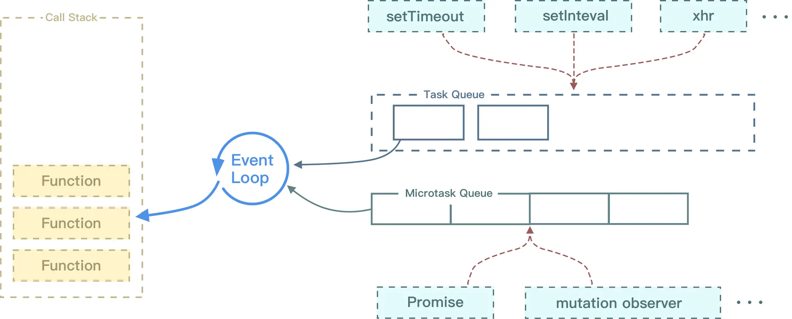
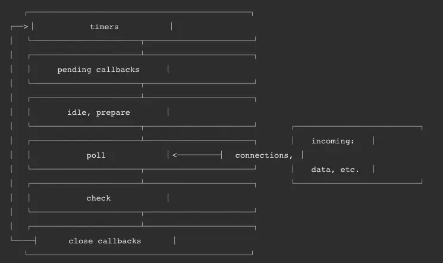

# 执行栈


先进后出原则

# 浏览器中的事件循环



当遇到异步代码时，会被挂起并在需要执行的时候加入到`Task`队列中，
一旦执行栈为空，`Event Loop`就会从`Task`队列中拿出需要执行的代码并放入到执行栈中执行

不同的任务源会被分配到不同的Task队列中，任务源可以分为`微任务(microtask)`和`宏任务(macrotask)`

在ES6规范中，`microtask`称为`jobs`，`macrotask`称为`task`

微任务：`process.nextTick(Nodejs独有)`、`queueMicrotask`、`promise.then`、`MutationObserve`

宏任务：`script`、`setTimeout`、`setInterval`、`setImmediate`、`I/O`、`UI rendering`

- 首先执行同步代码，这属于宏任务
- 执行完所有同步代码后，执行栈为空，查询是否有异步代码需要执行
- 执行所有的微任务
- 执行完所有微任务后，如有必要会渲染页面
- 开启下一轮的事件循环，执行宏任务中的异步代码，也就是`setTimeout`中的回调函数

联系：

```js
console.log('script start')

async function async1() {
    await async2()
    console.log('async1 end')
}

async function async2() {
    console.log('async2 end')
}

async1()

setTimeout(function () {
    console.log('setTimeout')
}, 0)

new Promise(resolve => {
    console.log('Promise')
    resolve()
})
    .then(function () {
        console.log('promise1')
    })

console.log('script end')

// script start
// async2 end
// Promise
// script end
// async1 end
// promise1
// setTimeout 
```

# Nodejs中的事件循环

Nodejs中的事件循环分为6个阶段，他们会按照顺序反复执行，每当进入某一个阶段的时候，都会从对应的回调队列中取出函数去执行。
当队列为空或者执行的回调函数数量达到系统设定的阈值，就会进入下一个阶段。



## timer

timer阶段会执行`setTimeout`和`setInterval`回调，并且是有poll阶段控制的

## pending callbacks

这个阶段会执行上一轮循环中的poll阶段被延迟执行的I/O回调

## idle，prepare

这个阶段内部使用，略

## poll

如果队列不为空，会遍历回调队列并执行，直到队列为空或者达到系统限制

接下来检查是否有`setImmediate`回调需要执行，有的话直接结束`poll阶段`并且进入到`check阶段`执行回调。

如果没有`setImmediate`回调需要执行，会block线程并等待一会儿，看是否有新的事件进入队列，有的话就去执行

在此过程中如果有timer需要执行，会回到`timer阶段`执行回调

## check

这个阶段执行setImmediate回调

## close callbacks

这个阶段执行关闭操作，比如关闭socket等

上述阶段都为宏任务的执行阶段，对于微任务来说，它会在以上每个阶段完成前**清空**microtask队列

Nodejs中的`process.nextTick`函数独立于事件循环外，他有一个自己的队列，当每个阶段完成后，如果存在nextTick队列，就会**清空队列中所有的回调函数**，并且优先于其他microtask执行


